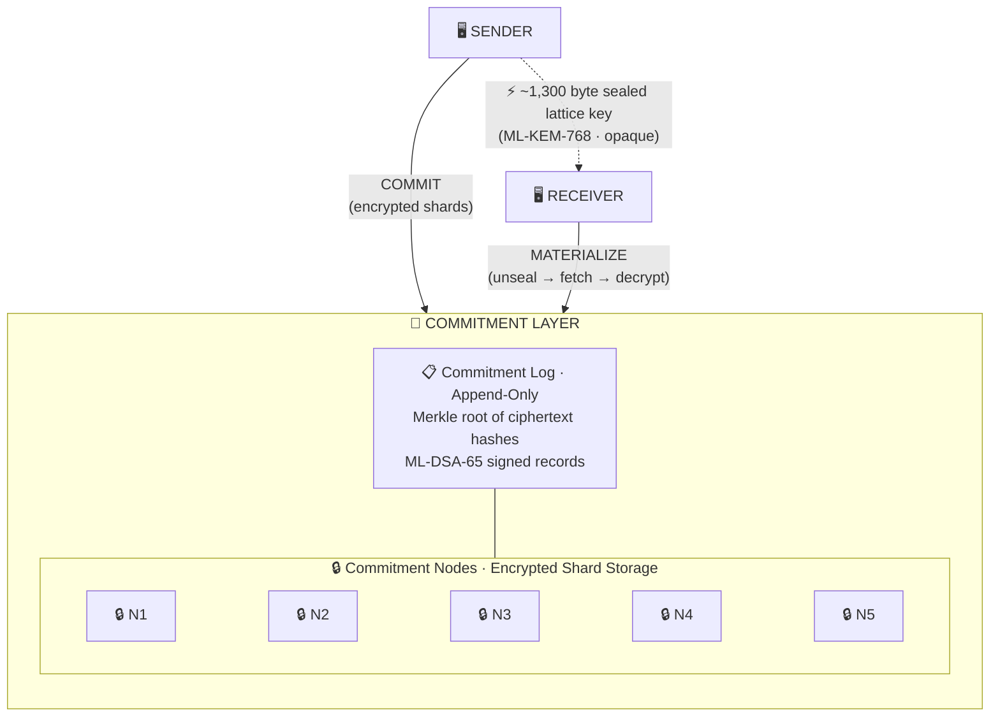
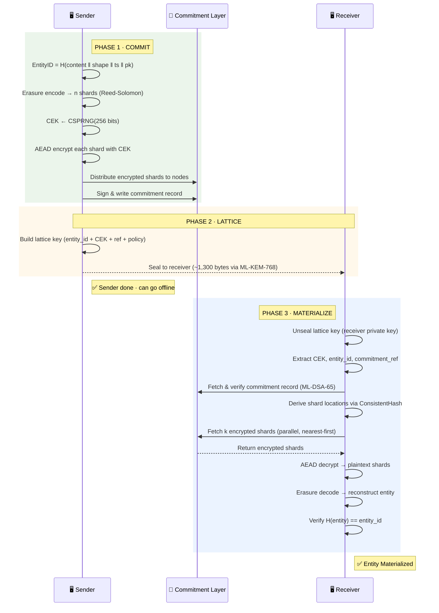

# Lattice Transfer Protocol (LTP)

### A Novel Data Transfer Protocol

> "Don't move the data. Transfer the proof. Reconstruct the truth."

---

## The Problem With Data Transfer Today

Every existing protocol — TCP/IP, HTTP, FTP, QUIC, even modern streaming protocols — operates
on the same foundational assumption:

**Data is a payload that must travel from Point A to Point B.**

This assumption chains us to three unsolvable constraints:
1. **Latency** — bound by the speed of light and routing hops
2. **Geography** — further = slower, always
3. **Compute** — larger payloads demand more processing at both ends

LTP rejects this assumption entirely.

---

## The Core Thesis

**Data transfer is not about moving bits. It is about transferring the *ability to reconstruct* a
deterministic output at a destination, verified by an immutable commitment.**

An LTP transfer consists of three atomic operations:

| Phase | Name | What Happens |
|-------|------|-------------|
| 1 | **Commit** | The sender creates an immutable, content-addressed commitment of the entity |
| 2 | **Lattice** | A minimal proof (the "lattice key") is transmitted to the receiver |
| 3 | **Materialize** | The receiver deterministically reconstructs the entity from distributed sources using the proof |

The entity is never serialized and shipped as a monolithic payload. It is **committed, proved, and reconstructed**.

---

## How It Works

### System Overview



> **Key insight:** The sender-to-receiver path carries only ~1,300 bytes regardless of entity size.
> All O(entity) work happens between sender↔network (commit) and network↔receiver (materialize),
> where nodes are geographically close to the receiver.

### Transfer Flow



### Security Stack

```mermaid
block-beta
    columns 1
    block:L6["🛡️ Layer 6 · ACCESS POLICY\nOne-time materialization · time-bounded · delegatable · revocable"]:1
    end
    block:L5["🔑 Layer 5 · SEALED ENVELOPE (ML-KEM-768)\nFresh encapsulation per seal · forward secrecy · zero metadata leakage"]:1
    end
    block:L4["🔒 Layer 4 · SHARD ENCRYPTION (AEAD)\nRandom 256-bit CEK · per-shard nonce · nodes store ciphertext only"]:1
    end
    block:L3["🕵️ Layer 3 · ZERO-KNOWLEDGE (Optional)\nGroth16 / BLS12-381 · EntityID hiding · ⚠️ not post-quantum"]:1
    end
    block:L2["✍️ Layer 2 · CRYPTOGRAPHIC INTEGRITY\nBLAKE3 content addressing · Merkle roots · ML-DSA-65 signatures"]:1
    end
    block:L1["🧮 Layer 1 · INFORMATION-THEORETIC SECURITY\nReed-Solomon erasure coding · k-of-n threshold · < k shards reveal nothing"]:1
    end

    style L6 fill:#1b5e20,color:#fff
    style L5 fill:#0d47a1,color:#fff
    style L4 fill:#4a148c,color:#fff
    style L3 fill:#e65100,color:#fff
    style L2 fill:#b71c1c,color:#fff
    style L1 fill:#263238,color:#fff
```

---

## Read the Full Specification

- [Protocol Whitepaper](docs/WHITEPAPER.md) — Full conceptual design
- [Architecture](docs/ARCHITECTURE.md) — System architecture and components
- [Proof-of-Concept](src/) — Reference implementation

---

## Quick Start

```
See docs/WHITEPAPER.md for the full protocol design.
See docs/ARCHITECTURE.md for system diagrams and component breakdown.
```

## License

This protocol specification is released for open exploration and research.
